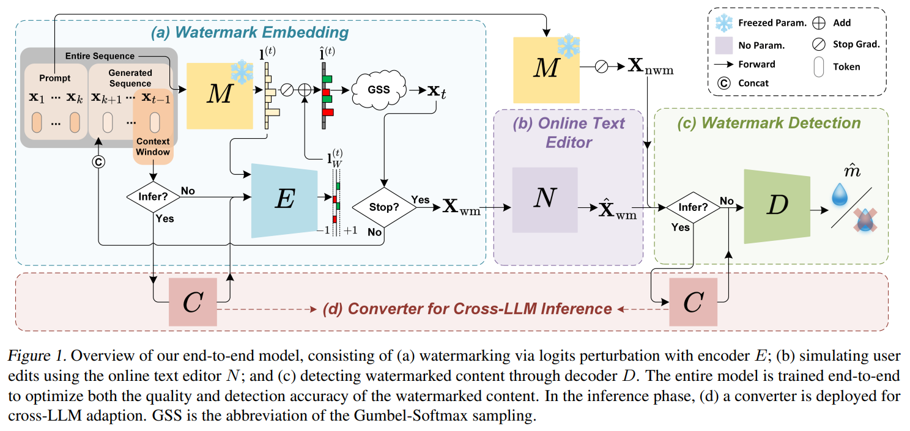

# E2E-LLM-Watermark

[](https://arxiv.org/abs/2505.02344)
[](https://openreview.net/forum?id=9sNiCqi2RD)
[](LICENSE)

> **E2E-LLM-Watermark** is an end-to-end logits-based watermarking framework for LLM-generated text that jointly optimizes encoder and decoder to improve robustness-quality tradeoffs under text edits.



---

## ✨ Highlights

- **End-to-end optimization** of watermark encoder and decoder.
- **Logits perturbation watermarking** integrated into autoregressive generation.
- **Online prompting strategy** to handle non-differentiable operations during training.
- **Unified evaluation pipeline** for both detection robustness and text quality.

---

## 📦 Repository Layout

```text
E2E-LLM-Watermark/
├── train/                  # training scripts (config, dataset, model, main)
├── watermark/              # watermark methods (E2E implementation)
├── evaluation/             # detection/quality pipelines and tools
├── utils/                  # utility modules
├── dataset/                # evaluation datasets (c4, human_eval, wmt16_de_en)
├── ckpt/                   # released checkpoint (e.g., 35000.pth)
├── fig/                    # figures used in README
├── test.py                 # evaluation entry
└── requirements.txt        # python dependencies
```

---

## 🚀 Quick Start

### 1) Environment

Recommended setup:
- Python 3.9
- PyTorch 2.1

Install dependencies:

```bash
pip install -r requirements.txt
```

### 2) Training

Before training:
1. Configure experiment paths and hyperparameters in `train/config.py` (especially `root`).
2. Set your Hugging Face token in `train/main.py` (`login(token=...)`).

Run:

```bash
cd train
python main.py
```

### 3) Evaluation

Run evaluation from repository root:

```bash
python test.py --llm_name Llama-2-7b-hf --assess_type det --assess_name paraphrase_dipper --ds_len 100
```

Main arguments:
- `llm_name`: `opt-1.3b` or `Llama-2-7b-hf`
- `assess_type`: `det` (detection) or `qlt` (quality)
- `assess_name`:
  - detection: `no_attack`, `context_substitute`, `paraphrase_dipper`
  - quality: `PPL`, `Log Diversity`, `BLEU`, `pass@1`
- `ds_len`: number of samples (`-1` for full set)

---

## ⚙️ Key Configuration

- **Training config** (`train/config.py`):
  - optimization (`lr`, `batch_size`, `weight_decay`, `epochs`)
  - watermark generation/training settings (`top_k_logits`, `wm_delta`, `context_win_size`)
  - experiment outputs (`exp_dir`, `ckpt_dir`)

- **Inference watermark config** (`watermark/e2e/e2e.py`, `E2EConfig`):
  - `delta`: watermark perturbation strength
  - `k`: top-k candidate size
  - `win_size`: context window size

---

## 📚 Citation

If this project helps your research, please cite:

```bibtex
@inproceedings{
    wong2025end,
    title={An End-to-End Model For Logits Based Large Language Models Watermarking},
    author={Wong, Kahim and Zhou, Jicheng and Zhou, Jiantao and Si, Yain-Whar},
    booktitle={Forty-second International Conference on Machine Learning},
    year={2025},
    url={https://openreview.net/forum?id=9sNiCqi2RD}
}
```

---

## 🙌 Acknowledgment

Evaluation is based on [MarkLLM](https://github.com/THU-BPM/MarkLLM).  
This method is inspired by prior LLM watermarking works: [SIR](https://github.com/THU-BPM/Robust_Watermark), [TSW](https://github.com/mignonjia/TS_watermark), and [UPV](https://github.com/THU-BPM/unforgeable_watermark).
