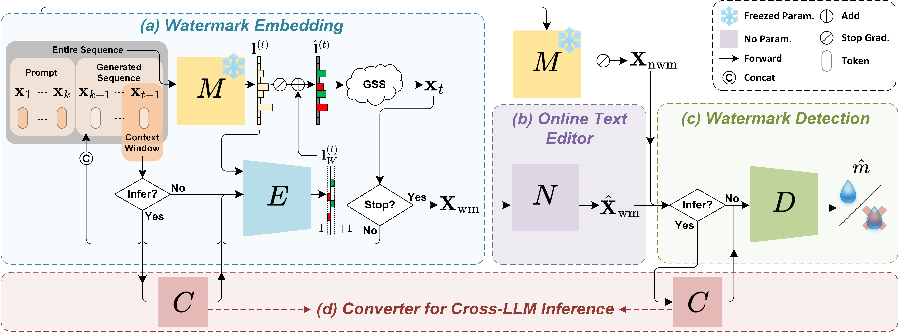

# An End-to-End Model for Logits Based Large Language Models Watermarking [ICML'25]

[](https://arxiv.org/pdf/2505.02344)


 
## Description   

---
The source code of the paper "An End-to-End Model for Logits Based Large Language Models Watermarking". The rise of LLMs has increased concerns over source tracing and copyright protection for AIGC, highlighting the need for advanced detection technologies. Passive detection methods usually face high false positives, while active watermarking techniques using logits or sampling manipulation offer more effective protection. Existing LLM watermarking methods, though effective on unaltered content, suffer significant performance drops when the text is modified and could introduce biases that degrade LLM performance in downstream tasks. These methods fail to achieve an optimal tradeoff between text quality and robustness, particularly due to the lack of end-to-end optimization of the encoder and decoder. In this paper, we introduce a novel end-to-end logits perturbation method for watermarking LLM-generated text. By jointly optimization, our approach achieves a better balance between quality and robustness. To address non-differentiable operations in the end-to-end training pipeline, we introduce an online prompting technique that leverages the on-the-fly LLM as a differentiable surrogate. Our method achieves superior robustness, outperforming distortion-free methods by 37–39\% under paraphrasing and 17.2\% on average, while maintaining text quality on par with these distortion-free methods in terms of text perplexity and downstream tasks. Our method can be easily generalized to different LLMs.    

## Training

---
The training code will be available soon.

## Evaluation

---
First, install dependencies: python 3.9, pytorch 2.1, and other packages by
```bash
pip install -r requirements.txt
```   

Run the ```test.py``` for testing our model.

```bash
python test.py
```

The ```test.py``` run the following function and the arguments are explained:

```python
def test(llm_name='opt-1.3b', assess_type='det', assess_name='no_attack', ds_len=-1):
    """
        Test the LLM with given assessment type and assessment name.

        Parameters:
            llm_name: The name of the LLM. 'opt-1.3b', 'Llama-2-7b-hf'
            assess_type: The type of assessment, 'det' for detection, 'qlt' for quality.
            assess_name: The name of the assessment.
                For detection, 'no_attack', 'context_substitute', 'paraphrase_dipper'.
                For quality, 'PPL', 'Log Diversity', 'BLEU', 'pass@1'.
            ds_len: The length of the dataset. If -1, the whole dataset is used.
    """
```

The hyper-parameters of our model can be changed in the ```watermark/e2e/e2e.py``` file.

```python
class E2EConfig:
    def __init__(self, transformers_config: TransformersConfig, ckpt) -> None:
        # wm cfg
        self.delta = 1.25
        self.k = 20
        self.win_size = 10

```

## Acknowledgements

---
The evaluation is performed based on the [MarkLLM](https://github.com/THU-BPM/MarkLLM), an tool for benchmarking LLM watermark methods.
The end-to-end method is greatly inspired by the llm watermarking methods: [SIR](https://github.com/THU-BPM/Robust_Watermark), [TSW](https://github.com/mignonjia/TS_watermark), and [UPV](https://github.com/THU-BPM/unforgeable_watermark). Many thanks to these awesome works for their great contributions.

## Citation

---
If you find our project useful in your research, please cite it in your publications.

```bibtex
@inproceedings{
    anonymous2025an,
    title={An End-to-End Model For Logits Based Large Language Models Watermarking},
    author={Anonymous},
    booktitle={Forty-second International Conference on Machine Learning},
    year={2025},
    url={https://openreview.net/forum?id=9sNiCqi2RD}
}
```